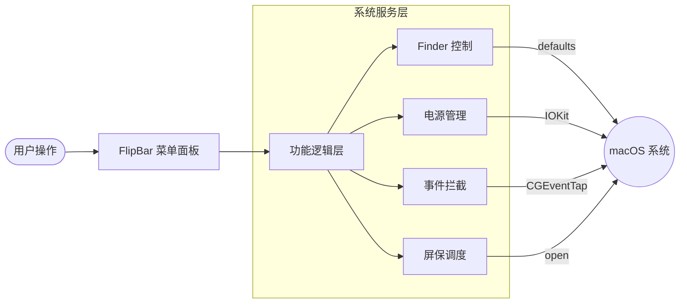

# FlipBar

<p align="center">
  <b>一个轻量级、原生且开源的 macOS 菜单栏效率工具</b>
  <br>
  <a href="LICENSE"></a>
  <a href="https://github.com/huangy7/FlipBar/releases"></a>
  
</p>

FlipBar 是一款为 macOS 用户设计的简约菜单栏工具，旨在通过简单的开关快速切换常用的系统设置。它采用 Swift 和 SwiftUI 开发，追求原生体验、低资源占用和高度的透明度。

---

## 🏗️ 逻辑架构

我们使用 Mermaid 图表展示 FlipBar 是如何与 macOS 系统底层交互的：



## ✨ 核心功能

- 🖥️ **一键隐藏桌面图标**：快速隐藏桌面上杂乱的文件，适合演示或追求极致整洁的工作流。
- ☕ **防止系统睡眠**：通过系统 Power Assertion 保持 Mac 唤醒，防止演示或长时间下载时屏幕熄灭。
- 🧼 **键盘清洁模式**：锁定绝大部分键盘输入并显示半透明遮罩，让你在不关机的情况下安全清洁键盘。
- 🖼️ **立即启动屏保**：无需等待系统超时，瞬间进入你设置的屏幕保护程序。

## 📱 界面预览 (模拟)

FlipBar 遵循 macOS 原生菜单栏应用设计规范，其面板布局如下：

| 功能项目 | 状态/操作 | 描述说明 |
| :--- | :---: | :--- |
| **Hide Desktop Icons** | `Toggle` | 临时隐藏桌面上的文件与文件夹 |
| **Keep Awake** | `Toggle` | 阻止 Mac 进入休眠状态 |
| **Keyboard Cleaning** | `Toggle` | 清洁时锁定大部分键盘输入 |
| **Start Screen Saver** | `Button` | 立即进入当前系统的屏幕保护程序 |
| --- | --- | --- |
| **Quit FlipBar** | `Exit` | 完全关闭并释放所有系统断言 |

## 🚀 快速开始

### 系统要求

- macOS 13.0 Ventura 或更高版本
- 具备辅助功能 (Accessibility) 权限（仅键盘清洁模式需要）

### 安装

目前你可以通过源码构建或下载 Release 产物：

1.  前往 [Releases](https://github.com/huangy7/FlipBar/releases) 页面。
2.  下载最新的 `FlipBar.dmg`。
3.  将 FlipBar 拖入 **应用程序 (Applications)** 文件夹。

## 🛠️ 构建指南

如果你是开发者，可以按照以下步骤自行构建：

```bash
# 克隆仓库
git clone https://github.com/huangy7/FlipBar.git
cd FlipBar

# 使用提供的脚本进行本地构建和签名
./build.sh
```

构建完成后，产物将位于 `build/Release/` 目录下，包含 `.app`、`.zip` 和 `.dmg` 格式。

## 📖 技术细节

- **架构**：采用模块化设计，将 UI (SwiftUI)、逻辑控制器 (Features) 与系统底层交互 (Services) 严格分离。
- **无沙盒设计**：为了能够修改 Finder 偏好设置、拦截全局键盘事件以及管理系统电源断言，本项目未启用 App Sandbox。
- **权限说明**：
  - **辅助功能 (Accessibility)**：键盘清洁模式使用 `CGEventTap` 来拦截按键，这需要用户在“系统设置 > 隐私与安全性 > 辅助功能”中手动授权。

## ⚠️ 已知限制

- **非硬件锁定**：键盘清洁模式是软件层面的拦截，无法阻止电源键、Touch ID、强制重启快捷键等底层硬件行为。
- **Finder 重启**：切换桌面图标显示时需要重启 Finder 进程，这可能会导致正在进行的 Finder 文件操作短暂中断。

## 🗺️ 路线图 (Roadmap)

- [ ] 支持登录时自动启动
- [ ] 自定义全局快捷键
- [ ] 更多系统开关（如：显示隐藏文件、切换深色模式、管理夜览等）
- [ ] 状态栏图标自定义

## 📄 开源协议

本项目基于 [MIT License](LICENSE) 许可协议开源。

---

<p align="center">
  由 <a href="https://github.com/huangy7">huangy7</a> 开发并维护
</p>
